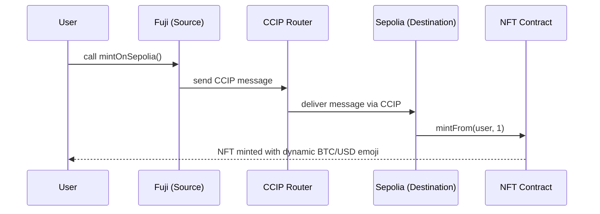

# 🌐 Cross-Chain Price NFT Project

---

## Overview

This project demonstrates **cross-chain NFT minting and dynamic SVG rendering** using **Chainlink CCIP (Cross-Chain Interoperability Protocol)** and **Chainlink Price Feeds**.  

It consists of three smart contracts that work together across two blockchains (**Ethereum Sepolia** and **Avalanche Fuji**) to:
- Dynamically mint and update NFTs with real-time price data.
- Transfer minting requests across chains using **CCIP**.
- Visualize market sentiment (price up, down, flat) directly on-chain through **SVG-based NFTs**.

---

## 🧩 Architecture Summary

| Chain | Contract | Purpose |
|-------|-----------|----------|
| **Sepolia (Ethereum)** | `CrossChainPriceNFT.sol` | Mints and updates dynamic NFTs using Chainlink price feeds. |
| **Sepolia (Ethereum)** | `CrossDestinationMinter.sol` | Receives CCIP messages and triggers NFT minting remotely. |
| **Fuji (Avalanche)** | `CrossSourceMinter.sol` | Sends CCIP messages to Sepolia to mint NFTs cross-chain. |

---

## ⚙️ Key Components

### 🖼️ 1. CrossChainPriceNFT (Ethereum Sepolia)
- ERC721 NFT contract that generates **on-chain SVGs** based on **BTC/USD prices** from Chainlink.
- Each NFT visually indicates market movement:
  - 😀 (Up)
  - 😔 (Down)
  - 😑 (Flat)
- Uses **Base64-encoded metadata** to store the full SVG and attributes directly in the token URI.
- Each NFT is colored differently depending on the chain (blue for Sepolia, red for Fuji).

**Core Features:**
- Real-time price tracking.
- Auto-updated NFT visuals via Chainlink Price Feed.
- Cross-chain minting support via CCIP.

**Price Feed used (Sepolia):**
> 0x1b44F3514812d835EB1BDB0acB33d3fA3351Ee43 // BTC/USD

---

### 🔁 2. CrossDestinationMinter (Ethereum Sepolia)
- A **CCIP receiver** contract that handles messages from other chains (like Avalanche Fuji).
- Upon receiving a message, it calls `mintFrom()` on the `CrossChainPriceNFT` contract to mint NFTs remotely.
- Also includes `testMint()` and `testMessage()` for local testing.

**Router used (Sepolia):**
> 0x0BF3dE8c5D3e8A2B34D2BEeB17ABfCeBaf363A59


---

### 📨 3. CrossSourceMinter (Avalanche Fuji)
- A **CCIP sender** contract that initiates cross-chain minting requests.
- Uses **LINK tokens** to pay for CCIP message fees.
- Sends an encoded `mintFrom(address,uint256)` function call to the Sepolia destination minter.
- Includes functions to:
  - Estimate CCIP message fees.
  - Withdraw unused LINK.
  - Monitor LINK balances.

**Router used (Fuji):**
> 0xF694E193200268f9a4868e4Aa017A0118C9a8177

**LINK Token (Fuji):**
> 0x0b9d5D9136855f6FEc3c0993feE6E9CE8a297846

---

## 🔗 Cross-Chain Flow



---

## 🧾 Example Usage

### 1️⃣ Deploy on Ethereum Sepolia
```bash
    npx hardhat run --network sepolia scripts/deployCrossChainPriceNFT.js
    npx hardhat run --network sepolia scripts/deployCrossDestinationMinter.js
```

### 2️⃣ Deploy on Avalanche Fuji
```bash
    npx hardhat run --network fuji scripts/deployCrossSourceMinter.js
```

### 3️⃣ Configure Addresses
After deployment:
    - Update the NFT address in the destination minter on Sepolia:
    ```js
        await destinationMinter.updateNFT("<CrossChainPriceNFT_Address>");
    ```
    - Update the destination minter address in the source minter on Fuji if needed.

### 4️⃣ Fund Fuji contract with LINK
```js
    # Fund with test LINK on Fuji testnet
    await linkToken.transfer(crossSourceMinter.address, ethers.utils.parseUnits("10", 18));
```

### 5️⃣ Trigger cross-chain mint
```bash
    # From Fuji (Avalanche)
    await crossSourceMinter.mintOnSepolia();
```

An NFT will appear on Sepolia, minted from Fuji, showing live BTC/USD sentiment.

---

## 🧮 Token Metadata Example

Example output from tokenURI(tokenId):
```json
    {
    "name": "Cross-chain Price SVG",
    "description": "SVG NFTs in different chains",
    "image": "data:image/svg+xml;base64,PHN2ZyB4bWxucz0i...",
    "attributes": [
        {"trait_type": "source", "value": "Fuji"},
        {"trait_type": "price", "value": "68294"}
    ]
    }
```
---

## 🧠 Functions Overview

### CrossChainPriceNFT

- `mint(address to)`  
- `mintFrom(address to, uint256 sourceId)`  
- `updateMetaData(uint256 tokenId, uint256 sourceId)`  
- `comparePrice()`  
- `getChainlinkDataFeedLatestAnswer()`  
- `tokenURI(uint256 tokenId)`  

### CrossDestinationMinter

- `_ccipReceive(Client.Any2EVMMessage memory message)`  
- `testMint()`  
- `testMessage()`  
- `updateNFT(address nftAddress)`  

### CrossSourceMinter

- `mintOnSepolia()`  
- `withdrawLINK(address beneficiary)`  
- `linkBalance(address account)`  
- `onlyOwner` modifier  

---

## ⚠️ Important Notes & Caveats

- **Unverified / Demo Code:** This project is for **educational purposes only**.  
  It uses **hardcoded router and feed addresses** for clarity.  
- **Do not use in production** without audits or safety upgrades.  
- **LINK Funding Required:** The Fuji sender must hold enough **LINK** to pay CCIP message fees.  
- **No Access Control:** Anyone can mint NFTs in this demo setup.  
- **Dynamic NFT Metadata:** Metadata is **Base64-encoded** and viewable on Etherscan or marketplaces that support on-chain metadata.  

---

## 🔐 Security Recommendations

- Add **access control** (e.g., `onlyOwner`) to restrict minting and message forwarding.  
- Validate all **incoming CCIP messages** (origin and source chain).  
- Consider adding a **pausable pattern** for message handling.  
- Review **gas limits** and add **reentrancy protection** for production use.  

---

## 🧑‍💻 Author

Developed for **MULLER NFT EDP Online 2025**  
Created with ❤️ using **Solidity**, **OpenZeppelin**, and **Chainlink CCIP**.  

---

## 📜 License

This project is licensed under the **MIT License**.  
See the `LICENSE` file for details.
